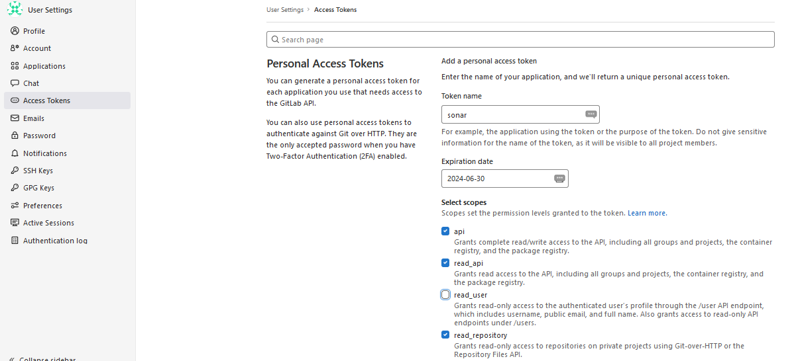
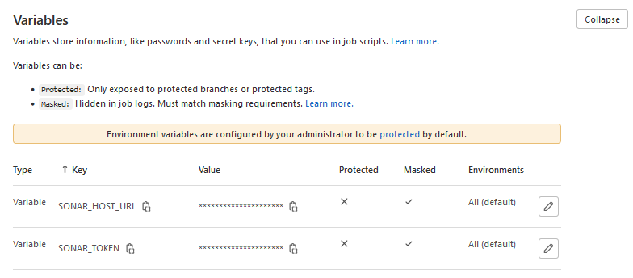
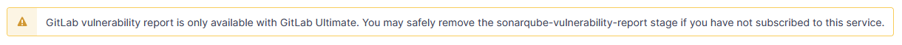

# Установка SonarQube в GitLab CI/CD

## Этап 1. Подготовка

Создадим пользователя SonarQube и выделим ему свою домашнюю директорию на сервере, в которой будут размещены настройки и данные SonarQube. Для этого на хосте выполним следующую команду:

```bash
sudo useradd sonarqube -m
# Ключ -m отвечает за создание домашней директории $HOME пользователя. Имя пользователя может быть произвольным.
```

### **Безопасность доступа к директории (опционально)**

Созданному пользователю в целях безопасности желательно установить пароль, после чего на "боевом" окружении вносить изменения в конфигурацию только через него.

```bash
sudo passwd sonarqube
```

### Расширение системных лимитов, создание файла конфигурации

Поскольку SonarQube использует встроенный ElasticSearch для индексации проверяемого кода, необходимо расширить границы системных лимитов, требующиеся для корректной работы ElasticSearch. Для этого выполним следующие команды от имени root **(sudo не сработает для ulimit, выдав ошибку)**

```bash
sysctl -w vm.max_map_count=524288
sysctl -w fs.file-max=131072
ulimit -n 131072
ulimit -u 8192
```

После чего переместимся в **$HOME** пользователя SonarQube и создадим там *compose* файл:

```bash
cd /home/sonarqube && touch docker-compose.yml
```

### **Отдельный пользователь для Docker (опционально)**

Сделаем созданный файл доступным только вашему **docker-админу**, если у Вас его всё ещё нет, его можно завести с помощью:

```bash
sudo useradd имя_докер_админа
sudo usermod -aG docker имя_докер_админа
```

После чего назначим созданного пользователя **владельцем** нашей конфигурации.

```bash
chown имя_докер_админа:docker docker-compose.yml
```

### Настройка docker-compose.yml

После выполнения всех ненужных действий заполним наш *compose* файл

```yaml
version: '3.8'

services:
  sonarqube:
    image: sonarqube:community
    restart: always
    container_name: sonarqube
    hostname: sonarqube.docker
    depends_on:
      postgres:
        condition: service_healthy
    networks:
      - default
      - gitlab
    ports:
      - "127.0.0.1:9000:9000"
    env_file: ./conf.d/sonarqube.env

  postgres:
    image: postgres
    restart: always
    container_name: sonarqube-db
    env_file: ./conf.d/postgres.env
    volumes:
      - ./postgresql:/var/lib/postgresql
      - ./data/postgresql:/var/lib/postgresql/data
    healthcheck:
      test: [ "CMD-SHELL", "pg_isready -U sonar" ]
      interval: 10s
      timeout: 5s
      retries: 5

networks:
  default:
    name: sonarqube
    driver: bridge
  gitlab: # Идентификатор сети GitLab'a, необходимо чтобы она была прописана в его docker-compose.yml
    external: true
```

Если у Вас всё ещё нет **docker compose**, необходимо установить его:

```bash
DOCKER_CONFIG=${DOCKER_CONFIG:-$HOME/.docker}
mkdir -p $DOCKER_CONFIG/cli-plugins
curl -SL https://github.com/docker/compose/releases/download/v2.27.0/docker-compose-linux-x86_64 -o $DOCKER_CONFIG/cli-plugins/docker-compose
```

Проверим, установлен ли наш docker compose или нет:

```bash
docker compose version
```

## Этап 2. Подключение

Создадим пользователя SonarQube в GitLab.


Создадим Personal Access Token для созданного пользователя со scope **api, read_api, read_repository**



После чего ключ появится в верхней части страницы, его будет необходимо скопировать, он больше не появится.


Перейдём в SonarQube и подключим его с помощью указанных данных.

1. Название конфигурации (произвольное)
2. Ссылка на API нашего GitLab (https://gitlab.example.com/api/v4)
3. Полученный нами токен


После чего система запросит токен пользователя чьи репозитории необходимо отслеживать.


Далее SonarQube покажет нам найденные репозитории, которые мы можем импортировать.


После импорта мы сможем выбрать метод, с помощью которого SonarQube будет проводить анализ в нашем репозитории. Выбираем **With GitLab CI**


SonarQube попросит настроить переменные, необходимые для его работы, а также выбрать конфигурацию под наш ЯП


Переходим в параметры CI/CD нашего репозитория, вводим необходимые значения, сгенерированные SonarQube'ом. Для каждого отдельного репозитория необходимо проводить эту операцию отдельно.


После установки переменных должна получиться примерно такая картина:



Идём обратно в SonarQube, после чего мы можем скопировать готовый .gitlab-ci.yml на основе выбранного нами ЯП.


Стейдж **sonarqube-vulnerability-report** можно удалить если вы не используете **GitLab Ultimate**



Добавляем выданную конфигурацию в наш репозиторий, и пайплайн готов к работе. Теперь мы можем смотреть отчёты по нашему коду в SonarQube.
